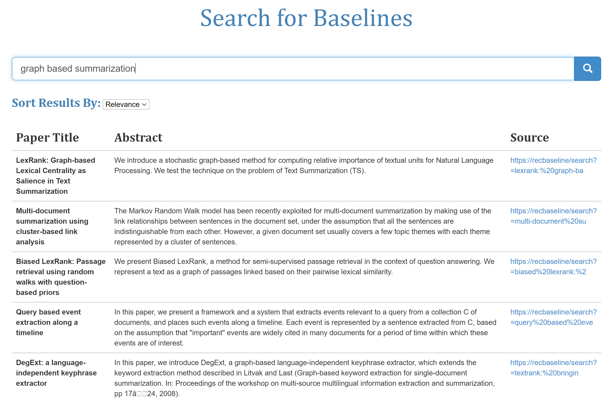

# Why Did You Not Compare With That? Finding Papers for Use as Baseline


This repository contains the model code as well as the data used in our paper titled "Why Did You Not Compare With That?Finding Papers for Use as Baselines (Add paper link)"

We release the dataset for the Baseline Classification task that consists of manually annotated corpus of research papers from the ACL anthology corpus, from which the citations are manually extracted and annotated into baselines or non baselines. 

## Data Format


  |KEY           |          VALUE                                                                  |
  |--------------|---------------------------------------------------------------------------------|
  |TITLE         |   Title of the paper                                                            |
  |ABSTRACT      |   Abstract of the paper                                                         |
  |CONTEXT       |   Context of full information present in the paper                              |
  |Extra         |   Extra supplimentary information calculated from the context                   |
  |tag           |   Whether the given paper is considered a baseline or not                       |
  
  

We further propose a neural attention based model architecture to classify references for a paper into baselines or non baselines. Our model achieves state of the art results when compared to other neural approaches.


## Running the Code 

Check for the configuration from the ```config.py``` file as per convinience.

For running the configuration directly:
```javascript
python final_baseline.py
```


## Web Tool

In order to further demonstrate the functionality of our paper, we create a Web based Search Engine("https://baselinesearch.herokuapp.com/") , that is based on Lucene's ElasticSearch mechanism to recommend possible baselines to the user based on the input made by the user. The application code is also included in the framework.




